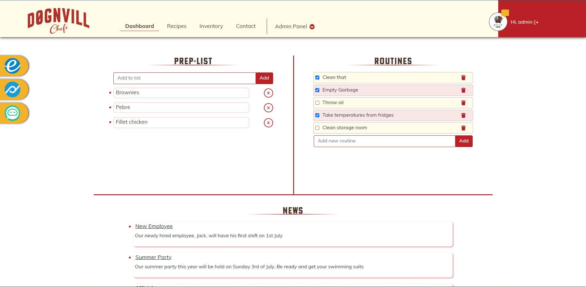

# JS Frameworks



Web-app for a restaurant to help the kitchen employees in their daily tasks

## Description

For now the app will help the chefs to gather their routines, prep-list, recipes and inventory in one place. Everything is connected to the api and the headchef can have control of
the functionalities from everywhere. The future plan for the app includes:
- Private api and dedicated database so that it can be used to more than one restaurant.
- Integrations of the external applications/links with functionalities of:
  - Making schedule.
  - Having forms to control food waste.
  - Deeper plan for routines (daily, weekly, monthly).
  - Section for educational purposes and employee training.
- Immersion of the inventory to make it even sipmler to use (categorize per area).

## Built With

- [React.js](https://reactjs.org/)
- [React Bootstrap](https://react-bootstrap.github.io/)
- [Sass](https://sass-lang.com/)
- [Strapi](https://strapi.io/)
- NPM packages
  - [React Hook Form](https://react-hook-form.com/)
  - [React Router Dom](https://v5.reactrouter.com/web/guides/quick-start)
  - [React Helmet](https://www.npmjs.com/package/react-helmet)
  - [React Icons](https://react-icons.github.io/react-icons/)
  - [React Marked](https://www.npmjs.com/package/marked-react)
  - [Yup](https://www.npmjs.com/package/yup)
  - [Axios](https://axios-http.com/docs/intro)


## Getting Started

### Installing

1. Clone the repo:

```bash
git clone git@github.com:Noroff-FEU-Assignments/project-exam-2-Fragki86.git
```

OR

download [GitHub Desktop](https://desktop.github.com/) and clone it straight from the repository.

2. Install the dependencies:

```
npm install
```

### Running

1. Opening the project:
```
npm run start
```

## Contributing

The project is open contribution, only by signing a contract of copyright. The contributions are restricted to future functionalities of the app. Suggestions for more functionalities that are aligning with the business can be discussed also. Regarding the design, no changes will be allowed. 
Make sure you open a pull request so that the code can be reviewed.

## Contact

You can find me also here:

[](https://www.facebook.com/giorgos.fragkias)  [](https://www.linkedin.com/in/georgios-fragkias-56026382/)  [](mailto:geo.fragkias@gmail.com)